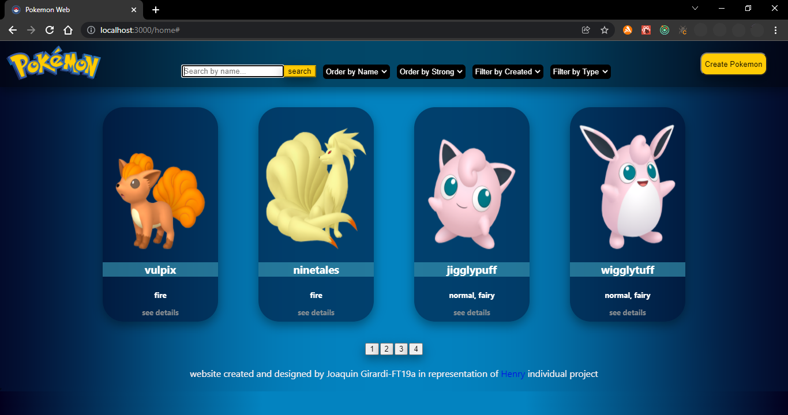
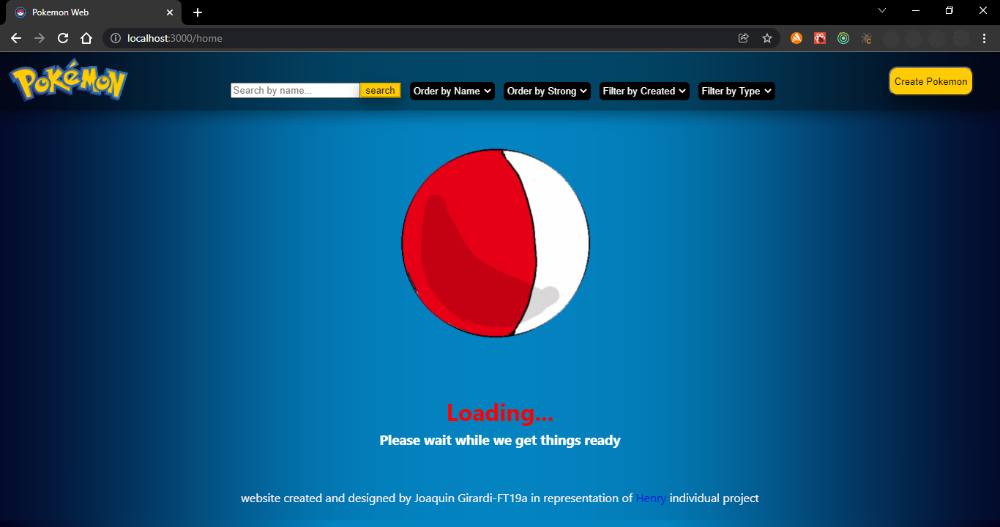

# Pokemon API

<p align="center">
  
</p>
<p align="center">
  
</p>
<p align="center">
  
</p>
<p align="center">
  
</p>

#### Used technology :
- [ ] React
- [ ] Redux
- [ ] Express
- [ ] Sequelize - Postgres

## BoilerPlate

The boilerplate has two folders: `api` and` client`. In these folders is the back-end and front-end code respectively.

In `api` create a file called:` .env` that has the following form:

```
DB_USER=postgresuser
DB_PASSWORD=Postgrespassword
DB_HOST=localhost
```

Replace `postgresuser` and` Postgrespassword` with your own credentials to connect to postgres. This file will be ignored in the github upload, as it contains sensitive information (the credentials).

Additionally it will be necessary to create from psql a database called `pokemon`

The content of `client` was created using: Create React App.

## Statement

The general idea is that the different Pokemon can be seen using the external api [pokeapi] (https://pokeapi.co/) and from there, among other things:

   - Search pokemons
   - Filter / Sort them
   - Create new pokemons

#### Frontend


__Main page__:
- [ ] Button to enter home (`Main route`)

__Main route__:
- [] Search input to find pokemons by name (The search will be exact, that is, it will only find the pokemon if the full name is entered)
- [] Area where you will see the list of pokemons. When starting, you must load the first results obtained from the `GET / pokemons` path and show its:
- Image
   - Name
   - Types (Electric, Fire, Water, etc)
- [] Buttons / Options to filter by type of pokemon and by existing pokemon or created by us
- [] Buttons / Options to sort the pokemons both in ascending and descending order by alphabetical order and by force
- [] Paged to go looking and showing the following pokemons, 12 pokemons per page.

__IMPORTANT__: Within the Main Path both the pokemons brought from the API as well as those from the database are shown.

__Detail Route of Pokemon__:
- [] Fields shown in the main path for each pokemon (image, name and types)
- [] Number of Pokemon (id)
- [] Statistics (life, strength, defense, speed)
- [ ] Height and weight

__Creating path__:
- [] A controlled form with the fields mentioned in the pokemon detail
- [] Ability to select / add more than one type of pokemon
- [] Button / Option to create a new pokemon

#### Data Base


- [] Pokemon with the following properties:
   - ID (Number of Pokemon) *
   - Name *
   - Life
   - Force
   - Defending
   - Speed
   - Height
   - Weight
- [] Type with the following properties:
   - ID
   - Name

#### Backend

Node / Express server with the following paths:

- [] __GET / pokemons__:
   - Get a list of pokemons from pokeapi.
   - Returns only the data necessary for the main route
- [] __GET / pokemons / {idPokemon} __:
   - Get the detail of a particular pokemon
   - Brings only the data requested in the pokemon detail path
- [] __GET /pokemons?name="..."__:
   - Gets the pokemon that exactly matches the name passed as a query parameter (It can be from pokeapi or created by us)
- [] __POST / pokemons__:
   - Receive the data collected from the controlled form of the pokemons creation path by body
   - Create a pokemon in the database
- [] __GET / types__:
   - Get all the possible types of pokemons

